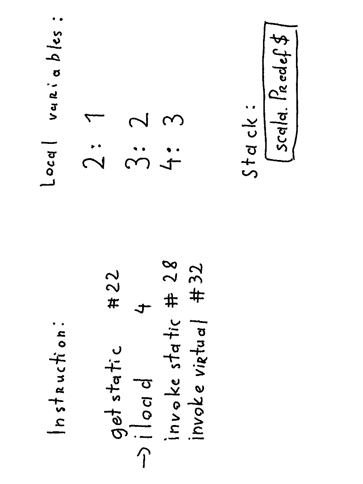

= Why You Should Care About JVM
:linkcss:

// --------------------------------- About me ---------------------------------

== About me

[%step]
* Scala developer for 5 years
* blogger - kubuszok.com
* ebook author - Things you need to know about JVM (that matter in Scala)
* OSS - scalaland.io

== Plan

[%step]
* What is JVM
* JVM types vs Scala types
* Threads
* Optimizations

[NOTE.speaker]
--
Stress that we're gonna just scratch the surface.
--

// ------------------------------- What is JVM --------------------------------

== What is JVM

=== Let's see by example

[source, scala]
--
object Test {

  def main(args: Array[String]): Unit = {
    val a = 1
    val b = 2
    val c = a + b
    println(c)
  }
}
--

[NOTE.speaker]
--
Let's see how Java version would look like.
--

=== Let's see by example

[source, java]
--
class Test {

  public static void main(String[] args) {
    int a = 1;
    int b = 2;
    int c = a + b;
    scala.Predef$.MODULE.println(
      scala.runtime.BoxRunTime.boxToInteger(c)
    );
  }
}
--

[NOTE.speaker]
--
`println` is imported from `scala.Predef`.
`MODULE` stores an instance of `scala.Predef`.
`println` doesn't take ints so they have to be converted. 
Now, lets see how bytecode would look like.
--

=== Let's see by example

[source, x86asm]
--
0: iconst_1
1: istore_2
2: iconst_2
3: istore_3
4: iload_2
5: iload_3
6: iadd
7: istore 4
9: getstatic #22; scala.Predef$.MODULE$ : scala.Predef$;
12: iload 4
14: invokestatic #28 ; scala.runtime.BoxesRunTime.boxToInteger(int): java.lang.Integer;
17: invokevirtual #32 ; scala.Predef$.println(java.lang.Object): void
--

[NOTE.speaker]
--
This looks intimidating so let's draw it on a piece of paper.
At first the additon part.
--

[transition=none]
=== How bytecode works

[.handle-img]
[.rotate-img]

[NOTE.speaker]
--
We have list of instructions on left, variables are using numbers, so compiler translates each name to a distinct number. In order to execute some instruction we'll use stacks to pass things around.
--

[transition=none]
=== How bytecode works

[.handle-img]
[.rotate-img]

[NOTE.speaker]
--
Push const 1 on stack.
--

[transition=none]
=== How bytecode works

[.handle-img]
[.rotate-img]

[NOTE.speaker]
--
Load value from top of the stack to variable 2.
--

[transition=none]
=== How bytecode works

[.handle-img]
[.rotate-img]

[NOTE.speaker]
--
Push const 2 on stack.
--

[transition=none]
=== How bytecode works

[.handle-img]
[.rotate-img]

[NOTE.speaker]
--
Load value from top of the stack to variable 3.
--

[transition=none]
=== How bytecode works

[.handle-img]
[.rotate-img]

[NOTE.speaker]
--
Push value from variable 2 on stack.
--

[transition=none]
=== How bytecode works

[.handle-img]
[.rotate-img]

[NOTE.speaker]
--
Push value from variable 3 on stack.
--

[transition=none]
=== How bytecode works

[.handle-img]
[.rotate-img]

[NOTE.speaker]
--
Take 2 values from top of the stack, add them, and push the result on the top of the stack.
--

[transition=none]
=== How bytecode works

[.handle-img]
[.rotate-img]

[NOTE.speaker]
--
Load value from top of the stack to variable 4.
--

[transition=none]
=== How bytecode works

[.handle-img]
[.rotate-img]

[NOTE.speaker]
--
We finished the addition part, so small reminder where we are in the original code.
--

[transition=none]
=== Reminder

[source, java]
--
class Test {

  public static void main(String[] args) {
    int a = 1;
    int b = 2;
    int c = a + b;
    // we finished here
    scala.Predef$.MODULE.println(
      scala.runtime.BoxRunTime.boxToInteger(c)
    );
  }
}
--

[NOTE.speaker]
--
So, why println doesn't accept `int`?
--

[transition=none]
=== How bytecode works

[.handle-img]
[.rotate-img]

[NOTE.speaker]
--
Primitives - basically boolean and numbers.
References - everything else.
Void - lack of returned value which has a special treatment.
--

[transition=none]
=== How bytecode works

[.handle-img]
[.rotate-img]

[NOTE.speaker]
--
Get the value of static field and put it on the top of the stack.
--

[transition=none]
=== How bytecode works

[.handle-img]
[.rotate-img]

[NOTE.speaker]
--
Push value of variable 4 to the top of the stack. 
--

[transition=none]
=== How bytecode works

[.handle-img]
[.rotate-img]

[NOTE.speaker]
--
Invoke static method taking arguments from the stack and put result on the stack. 
--

[transition=none]
=== How bytecode works

[.handle-img]
[.rotate-img]

[NOTE.speaker]
--
Invoke virtual method taking arguments (inluding objects that we invoke the method on) from the stack and put result on the stack. 
--

[transition=none]
=== How bytecode works

[.handle-img]
[.rotate-img]

[NOTE.speaker]
--
The calls were quite interesting so let's stop for a minute.
--

=== Calls and returns

[.handle-img]
[.rotate-img]

[NOTE.speaker]
--
The calls were quite interesting so let's stop for a minute. Static calls take only arguments, virtual take also object (because method might be polymorphic).
--

=== Stack traces

[.handle-img]
[.rotate-img]

[NOTE.speaker]
--
All we had before - which method we are in, program counter, local variables, operand stack - live inside a `Frame`. When we make a call we create a new Frame and when we return we destroy the current one and return to immediate previous `Frame`.
--

// ------------------------ JVM types vs Scala types --------------------------

== JVM types vs Scala types

=== Scala type hierarchy

[.handle-img]
[.rotate-img]

[NOTE.speaker]
--
We have a top type and a bottom type. Unit is a normal type with a value. While Scala distinguishes between primitive types and reference types, it is most of the time transparent to us.
--

=== Java type hierarchy

[.handle-img]
[.rotate-img]

[NOTE.speaker]
--
Primitives are special. Void is special. There is no bottom type. There are function that would not compose, e.g. everything returning void. Suppliers (no arguments), Consumers (no returns).
--

=== Comparison

[%step]
* `scala.AnyVal` s are automatically compiled to primitives OR boxed if needed, so they are dscribed using separate types
* there is `scala.Null` subtype of all references
* there is `scala.Nothing` subtype of all types

[NOTE.speaker]
--
A few more words about numbers.
--

=== A bit more about numbers

[%step]
* JVM primitives are separate types with no common sub- or supertype
* however they can be boxed with subclasses of `java.lang.Number` to share an interface
* Scala's numbers share `AnyVal` which has no common numeric methods, so instead we rely on `scala.Numeric` type class

=== Generics

[source, scala]
--
// what we see

def head[A](nel: NonEmptyList[A]): A = ...

val value: String = head(stringNel)
--

[source, scala]
--
// pseudocode of what JVM sees

// List can only contain java.lang.Object
def head(list: List): java.lang.Object = ...

// stringNel forgot its type parameter so we have to retrieve it
val value: String = headOption(stringNel).asInstanceOf[String]
--

[NOTE.speaker]
--
Type erasure instead of reified types, they are actually useful because it allows us to implement things that Java's type system wouldn't allow.
Drawbacks are usually addressed with `@specialize`. Exception is reflection.
--

// -------------------------------- Threads -----------------------------------

== Threads

TODO: maps directly into system threads

=== synchronized, wait, notify

TODO

[NOTE.speaker]
--
blocking, mutexes
--

=== Threads pools

TODO

[NOTE.speaker]
--
ExecutionContext, Scheduler
--

// ----------------------------- Optimizations --------------------------------

== Optimizations

[NOTE.speaker]
--
If JVM was only emulator of non-existend processor it would be pretty slow. However that's not the case. How it's possible?
--

=== Compilers

[.handle-img]
[.rotate-img]

[NOTE.speaker]
--
`-XX:MaxTrivialSize=6`, `-XX:MaxInlineSize=35`, `-FreqInlineSize=325` (bytes), there are limits on inlining `-XX:MaxInlineLevel=9`, `-XX:InlineSmallCode=1000`.
--

=== Examples

TODO

=== Some rules

TODO when optimization won't work

=== TODO

TODO image from deep stack on JEE/Springś 

// -------------------------------- Summary -----------------------------------

== Summary
